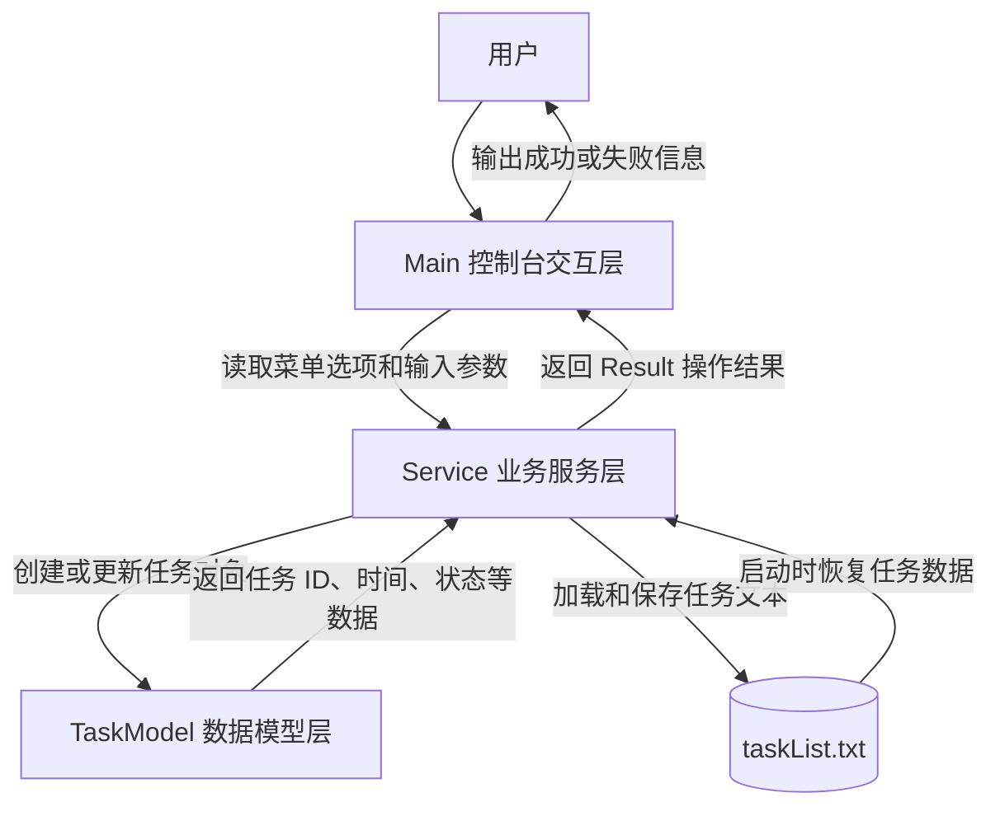

# TaskManagerSystem3.0

## 项目设计目的

TaskManagerSystem3.0 是一个基于 Java 控制台的任务管理系统。项目目标是用清晰的三层结构实现任务的创建、查询、完成、删除和本地持久化，帮助学习 Java 面向对象设计、文件读写、时间处理和基础测试方法。

系统以 `Main` 作为控制台入口，以 `Service` 作为业务处理中心，以 `TaskModel` 作为任务数据模型。任务数据保存在 `taskList.txt` 中，程序启动时加载文件，执行任务操作后写回文件。

## 应用场景

- 个人日常任务管理：适用于记录会议准备、学习计划、项目里程碑等任务，支持按时间范围查看与按 ID 查询，并自动更新过期状态。
- 团队备忘录演练：用于演示如何在控制台程序中输入任务信息、校验必填字段、管理任务状态，以及在任务完成后标记和查询。
- Java 面向对象与分层架构练习：通过 `Main`、`Service`、`TaskModel` 三层划分，实践输入处理、业务校验、状态维护与数据持久化。
- 文件持久化学习场景：适合学习如何把运行时任务数据保存到 `taskList.txt`，并在程序重启后恢复任务列表；同时练习异常提示与错误处理。
- 自动状态同步场景：系统启动、查询或退出时自动扫描任务时间，保证过期任务状态自动更新，避免手动维护状态错漏。

## 三层交互过程

## 核心功能

系统提供以下六大核心功能：

### 1. 创建任务
- **功能描述**：录入任务名称、开始时间、结束时间，创建新的任务记录。
- **输入项**：任务名称、开始时间、结束时间。
- **合法性校验**：任务名称不能为空；开始/结束时间需符合 `yyyy-M-d H:m:s` 格式；开始时间不可晚于结束时间；任务编号自动生成且保持系统唯一。
- **个性化错误提示**：当任务名为空、时间格式错误或时间顺序不合法时，系统返回自定义提示语，明确指出“任务名称缺失”、“时间格式不正确”或“开始时间不得晚于结束时间”。

### 2. 查询任务
- **功能描述**：提供全部任务查询与按 ID 查询两种模式，方便用户快速定位任务。
- **输入项**：查询全部或输入任务 ID 进行精准查询。
- **合法性校验**：若按 ID 查询时，校验输入 ID 是否存在；若不存在，则返回“任务不存在，请检查任务编号”。
- **个性化错误提示**：查询失败时输出统一格式提示，例如“查询失败：不存在任务编号 [ID]，请重新输入”。

### 3. 自动更新状态
- **功能描述**：在系统启动、关闭或查询时自动扫描任务时间，将已过期的任务状态更新为 `COMPLETED`。
- **输入项**：无需额外输入，系统按当前时间自动检查任务。
- **合法性校验**：对每个任务进行时间比对，确保状态只在未完成时进行更新。
- **个性化错误提示**：若扫描过程中发现异常时间数据，输出“状态更新失败：任务时间数据异常，请检查输入格式”。

### 4. 完成任务
- **功能描述**：将指定任务状态从 `TO_DO` 或 `IN_PROGRESS` 更新为 `COMPLETED`。
- **输入项**：任务 ID。
- **合法性校验**：校验任务 ID 是否存在，且当前状态是否允许标记为已完成。
- **个性化错误提示**：当任务 ID 无效或任务已完成时，返回“完成失败：任务编号无效或任务已处于完成状态”。

### 5. 删除任务
- **功能描述**：删除指定任务，并从内存与持久化文件中移除其记录。
- **输入项**：任务 ID。
- **合法性校验**：检查任务 ID 是否存在；若任务不存在，则拒绝删除。
- **个性化错误提示**：删除失败时显示“删除失败：未找到任务编号 [ID]，请确认后重试”。

### 6. 持久化存储
- **功能描述**：将任务数据保存到本地文件 `taskList.txt`，并在程序启动时自动加载恢复。
- **输入项**：菜单选择保存或自动在程序退出/启动时触发。
- **合法性校验**：读取文件时校验每行格式是否完整；写入时确保文件可访问且数据完整。
- **个性化错误提示**：持久化异常时输出“数据持久化失败：请检查文件权限或格式”。

## 核心模块说明

- `Main`：负责控制台菜单、用户输入和结果输出，不直接处理任务规则。
- `Service`：负责业务规则，包括参数校验、任务状态扫描、任务集合维护和文件读写。
- `TaskModel`：负责描述单个任务的数据结构，包括任务 ID、名称、开始时间、结束时间和状态。
- `Result` 包：负责封装不同操作的返回状态，使界面层可以根据状态输出对应提示。
- `test/com/zzm/ServiceTest.java`：纯 Java 测试入口，用自定义断言验证核心业务行为。

# github个人仓库网址
> https://github.com/Z-ZM-creator
