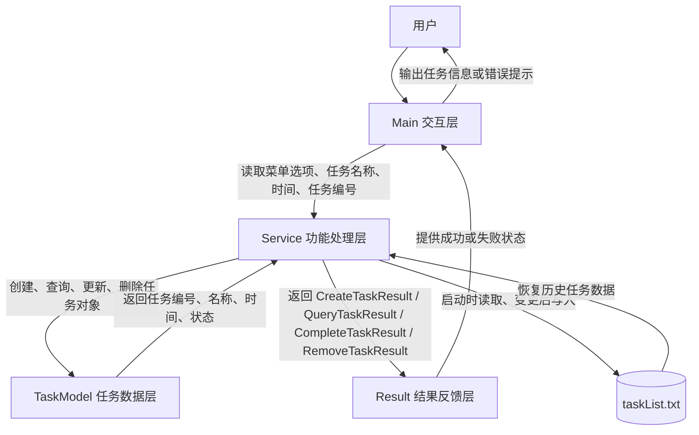
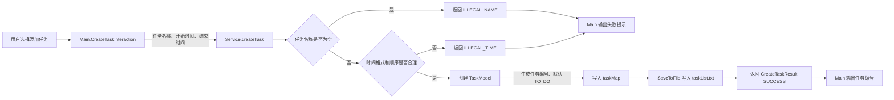
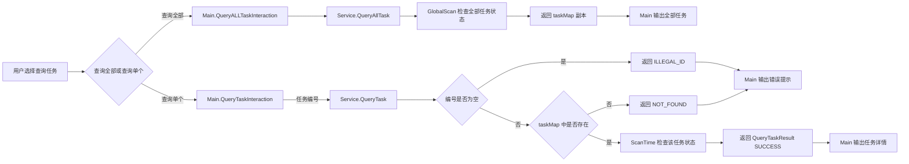
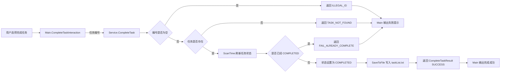
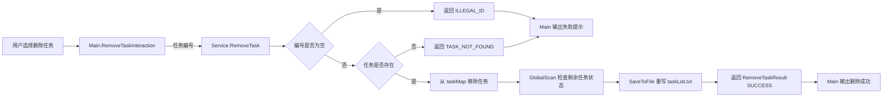
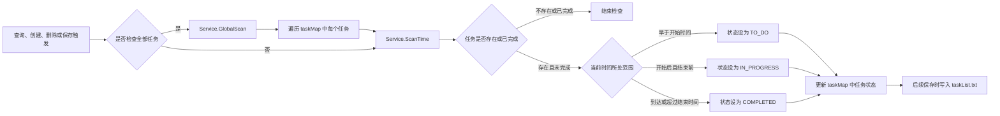
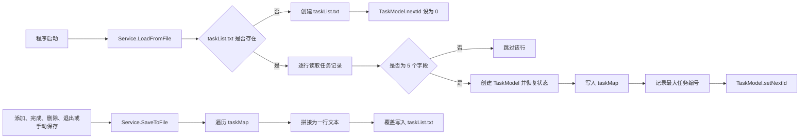

# 大学生学习任务管理系统

## 一、项目背景与应用场景

大学生在日常学习中经常需要同时处理多类任务，例如课程作业、实验报告、复习计划、社团事务和项目任务等。任务数量较多时，如果只依靠记忆或零散记录，容易出现遗忘、拖延、时间安排混乱等问题。

本项目选择“大学生学习任务管理”作为具体应用场景，目标是提供一个简单、清晰的任务管理工具，帮助用户记录、查看、完成和删除学习任务。通过对任务开始时间、结束时间和完成状态的管理，系统可以让学习安排更加直观，减少因忘记时间而造成的遗漏。

该系统适合用于以下场景：

- 记录课程作业、实验任务、复习计划等学习事项。
- 查看当前还有哪些任务需要完成。
- 将已经完成的任务标记为完成，方便区分任务状态。
- 删除不再需要保留的任务，让任务列表保持简洁。
- 关闭系统后继续保留任务信息，便于下次继续查看和管理。

## 二、功能需求描述

本系统主要实现以下功能：

### 1. 添加任务

用户可以录入新的学习任务，包括任务名称、开始时间和结束时间，用于记录课程作业、实验任务、复习计划等事项。

### 2. 查询任务

用户可以查看所有任务，也可以根据任务编号查询某一个具体任务，方便快速了解任务安排。

### 3. 完成任务

当某项任务已经完成后，用户可以将该任务标记为已完成，便于区分已完成任务和未完成任务。

### 4. 删除任务

对于已经不需要继续保留的任务，用户可以将其删除，使任务列表保持简洁。

### 5. 自动检查任务状态

系统可以根据任务时间对任务状态进行检查，帮助用户发现已经到期的任务，减少因忘记时间而造成的遗漏。

### 6. 保留历史任务数据

用户关闭系统后，已经记录的任务信息不会丢失，下次打开系统时仍然可以继续查看和管理。

## 三、系统使用流程

用户打开系统后，会看到功能菜单，并根据菜单提示选择需要执行的操作。

1. 选择“添加任务”时，用户依次输入任务名称、开始时间和结束时间，系统保存新的任务记录。
2. 选择“查询所有任务”时，系统展示当前已经记录的全部任务。
3. 选择“查询单个任务”时，用户输入任务编号，系统显示对应任务的详细信息。
4. 选择“完成任务”时，用户输入任务编号，系统将该任务标记为已完成。
5. 选择“删除任务”时，用户输入任务编号，系统删除对应任务。
6. 选择“保存任务”时，系统将当前任务信息保存下来。
7. 选择“退出系统”时，系统会自动保存任务信息，方便用户下次继续使用。

通过上述流程，用户可以围绕“记录任务、查看任务、完成任务、清理任务”完成完整的学习任务管理过程。

## 四、系统设计与实现思路

系统围绕用户的任务管理过程进行设计，将整体功能划分为交互输入、功能处理、任务数据、结果反馈和数据保存几个部分。这样的设计能够让不同部分各自负责明确的工作，使系统结构更清晰，也便于后续维护和扩展。

系统层级交互关系如下：



### 1. 交互层设计思路

交互层负责向用户展示菜单、接收用户输入，并把用户选择的操作传递给后续功能处理部分。用户不需要了解系统内部如何运行，只需要根据提示输入任务信息或任务编号即可完成操作。

在本项目中，`Main` 类承担交互入口的作用，主要负责：

- 展示添加、查询、完成、删除、保存和退出等菜单选项。
- 读取用户输入的任务名称、时间和任务编号。
- 根据不同操作结果向用户展示成功或失败提示。

### 2. 功能处理层设计思路

功能处理层负责判断用户输入是否合理，并完成任务创建、查询、完成、删除、状态检查和保存等核心操作。它是系统的主要处理中心，避免交互部分直接修改任务数据。

在本项目中，`Service` 类承担功能处理作用，主要负责：

- 检查任务名称是否为空。
- 检查任务时间格式和时间顺序是否合理。
- 根据任务编号查找指定任务。
- 根据当前时间更新任务状态。
- 在任务发生变化后保存任务信息。

### 3. 任务数据层设计思路

任务数据层用于描述一条具体任务应包含哪些信息。每条任务都有任务编号、任务名称、开始时间、结束时间和任务状态。通过统一的任务对象保存这些信息，可以让系统在创建、查询、完成和删除任务时使用同一种数据结构。

在本项目中，`TaskModel` 类用于表示单个任务，任务状态包括：

- `TO_DO`：任务尚未开始。
- `IN_PROGRESS`：任务正在进行。
- `COMPLETED`：任务已经完成。

### 4. 结果反馈设计思路

系统在执行操作后，需要告诉用户操作是否成功，以及失败原因是什么。例如任务名称为空、时间格式错误、任务编号不存在或任务已经完成等情况，都需要给出明确反馈。

在本项目中，`Result` 包中的结果类用于保存不同操作的返回结果，使交互层能够根据结果状态输出对应提示。

### 5. 数据保存设计思路

为了让用户关闭系统后仍然保留任务信息，系统会将任务数据保存到 `taskList.txt` 文件中。程序启动时读取已有任务，任务新增、完成、删除或退出时保存当前任务信息，从而实现历史任务数据的延续。

## 五、核心功能实现说明

### 1. 添加任务的实现

交互与数据流图：



#### 1. 用户操作流程

用户在菜单中选择“Create a task”，依次输入任务名称、开始时间和结束时间。系统根据输入内容创建新的学习任务，并在创建成功后返回任务编号。

#### 2. 涉及的主要类或方法

- `Main.CreateTaskInteraction()`：负责读取用户输入，并调用任务创建功能。
- `Service.createTask()`：负责校验任务名称和时间，创建任务并保存。
- `TaskModel`：负责保存单个任务的编号、名称、开始时间、结束时间和状态。
- `CreateTaskResult`：负责返回创建成功或失败的状态。

#### 3. 核心判断逻辑

系统会先判断任务名称是否为空，再判断开始时间和结束时间是否符合 `yyyy-M-d H:m:s` 格式。时间格式正确后，还会判断开始时间是否晚于结束时间，以及结束时间是否早于当前时间。

#### 4. 异常或错误处理

如果任务名称为空，系统返回 `ILLEGAL_NAME`；如果时间为空、格式错误或时间顺序不合理，系统返回 `ILLEGAL_TIME`。交互层根据返回状态向用户输出对应失败提示。

#### 5. 数据如何变化

输入合法时，系统会创建一个新的 `TaskModel` 对象，自动生成任务编号，默认状态为 `TO_DO`。随后任务会加入 `Service` 中的 `taskMap`，并通过 `SaveToFile()` 写入 `taskList.txt`。

保存格式为：

```text
任务编号,任务名称,开始时间,结束时间,任务状态
```

---

### 2. 查询任务的实现

交互与数据流图：



#### 1. 用户操作流程

用户可以在菜单中选择“Query ALL tasks”查看全部任务，也可以选择“Query a task”并输入任务编号查看某一个具体任务。

#### 2. 涉及的主要类或方法

- `Main.QueryALLTaskInteraction()`：负责展示全部任务。
- `Main.QueryTaskInteraction()`：负责读取任务编号并展示单个任务。
- `Service.QueryAllTask()`：负责返回全部任务数据。
- `Service.QueryTask()`：负责根据任务编号查找任务。
- `QueryTaskResult`：负责返回查询成功、任务不存在或编号非法等状态。

#### 3. 核心判断逻辑

查询全部任务时，系统先调用 `GlobalScan()` 检查全部任务状态，再返回任务列表副本。查询单个任务时，系统先判断任务编号是否为空，再判断 `taskMap` 中是否存在该编号。

#### 4. 异常或错误处理

如果任务编号为空，系统返回 `ILLEGAL_ID`；如果任务编号不存在，系统返回 `NOT_FOUND`。交互层根据结果提示“Task query failed”或“Task not found”。

#### 5. 数据如何变化

查询操作一般不新增或删除任务，但会触发任务状态检查。如果某个任务时间已经变化，状态可能从 `TO_DO` 更新为 `IN_PROGRESS`，或从 `IN_PROGRESS` 更新为 `COMPLETED`。查询全部任务时，系统返回的是 `taskMap` 的副本，避免外部直接修改内部任务集合。

---

### 3. 完成任务的实现

交互与数据流图：



#### 1. 用户操作流程

用户在菜单中选择“Complete a task”，输入需要标记完成的任务编号。系统找到对应任务后，将任务状态改为已完成。

#### 2. 涉及的主要类或方法

- `Main.CompleteTaskInteraction()`：负责读取任务编号并输出完成结果。
- `Service.CompleteTask()`：负责查找任务、检查状态并完成任务。
- `Service.ScanTime()`：负责在完成前刷新该任务的当前状态。
- `CompleteTaskResult`：负责返回完成成功、任务不存在、任务已完成或编号非法等状态。

#### 3. 核心判断逻辑

系统先判断任务编号是否为空，再判断任务是否存在。任务存在时，系统会先调用 `ScanTime()` 根据当前时间刷新任务状态。如果任务当前已经是 `COMPLETED`，则不允许重复完成；如果任务尚未完成，则将状态设置为 `COMPLETED`。

#### 4. 异常或错误处理

如果任务编号为空，系统返回 `ILLEGAL_ID`；如果任务不存在，返回 `TASK_NOT_FOUND`；如果任务已经完成，返回 `FAIL_ALREADY_COMPLETE`。交互层根据结果输出对应提示。

#### 5. 数据如何变化

完成成功后，目标任务在 `taskMap` 中的状态被更新为 `COMPLETED`。随后系统调用 `SaveToFile()`，将更新后的状态写回 `taskList.txt`，使下次打开系统时仍能看到该任务已完成。

---

### 4. 删除任务的实现

交互与数据流图：



#### 1. 用户操作流程

用户在菜单中选择“Remove a task”，输入需要删除的任务编号。系统确认任务存在后，将该任务从任务列表中移除。

#### 2. 涉及的主要类或方法

- `Main.RemoveTaskInteraction()`：负责读取任务编号并输出删除结果。
- `Service.RemoveTask()`：负责查找任务、删除任务并保存数据。
- `RemoveTaskResult`：负责返回删除成功、任务不存在或编号非法等状态。

#### 3. 核心判断逻辑

系统先判断任务编号是否为空，再判断 `taskMap` 中是否存在该编号。只有任务存在时，系统才会执行删除操作。

#### 4. 异常或错误处理

如果任务编号为空，系统返回 `ILLEGAL_ID`；如果任务编号不存在，返回 `TASK_NOT_FOUND`。交互层根据结果提示用户任务不存在或编号非法。

#### 5. 数据如何变化

删除成功后，目标任务会从 `taskMap` 中移除。系统随后调用 `GlobalScan()` 检查剩余任务状态，再调用 `SaveToFile()` 将删除后的任务列表重新写入 `taskList.txt`。

---

### 5. 自动检查任务状态的实现

交互与数据流图：



#### 1. 用户操作流程

自动检查任务状态不需要用户单独输入。用户在查询、删除、创建或保存任务时，系统会根据实际时间自动更新任务状态。

#### 2. 涉及的主要类或方法

- `Service.ScanTime()`：负责检查单个任务状态。
- `Service.GlobalScan()`：负责遍历全部任务并逐个检查状态。
- `Service.QueryAllTask()`、`Service.createTask()`、`Service.RemoveTask()`、`Service.SaveToFile()`：在不同操作过程中触发状态检查或保存。

#### 3. 核心判断逻辑

系统会用当前时间与任务的开始时间、结束时间进行比较：

- 当前时间早于开始时间，任务状态保持或更新为 `TO_DO`。
- 当前时间不早于开始时间，且还没有超过结束时间，任务状态更新为 `IN_PROGRESS`。
- 当前时间不早于结束时间，任务状态更新为 `COMPLETED`。

如果任务已经是 `COMPLETED`，`ScanTime()` 会直接返回，不再重复更新。

#### 4. 异常或错误处理

如果传入的任务编号不存在，`ScanTime()` 会直接结束，不执行状态更新。任务时间在创建时已经经过格式校验，因此正常情况下状态检查过程不需要用户额外处理异常。

#### 5. 数据如何变化

自动检查会改变任务对象中的 `status` 字段。例如任务可能从 `TO_DO` 变为 `IN_PROGRESS`，也可能从 `IN_PROGRESS` 变为 `COMPLETED`。当后续保存动作发生时，新的状态会被写入 `taskList.txt`。

---

### 6. 保留历史任务数据的实现

交互与数据流图：



#### 1. 用户操作流程

用户打开系统时，系统自动读取之前保存的任务。用户添加、完成、删除任务后，系统会保存最新任务信息。用户选择保存或退出系统时，系统也会将当前任务列表保存下来。

#### 2. 涉及的主要类或方法

- `Service.LoadFromFile()`：负责从 `taskList.txt` 读取历史任务。
- `Service.SaveToFile()`：负责把当前任务写回 `taskList.txt`。
- `TaskModel.setNextId()`：负责恢复下一个可用任务编号，避免编号重复。

#### 3. 核心判断逻辑

加载任务时，系统会判断 `taskList.txt` 是否存在。如果文件不存在，则创建新文件并从编号 `0` 开始。读取文件时，系统按逗号分隔每行数据，并只加载字段数量正确的任务记录。

保存任务时，系统会遍历 `taskMap` 中的所有任务，将每个任务转换为一行文本记录，再覆盖写入 `taskList.txt`。

#### 4. 异常或错误处理

如果读取或写入文件时发生异常，系统会捕获 `IOException`；如果文件中的状态内容无法转换为系统支持的状态，系统会捕获 `IllegalArgumentException`。当前实现会输出异常信息，便于定位文件读取或数据格式问题。

#### 5. 数据如何变化

程序启动时，`taskList.txt` 中的记录会被转换成 `TaskModel` 对象并放入 `taskMap`。程序运行过程中，`taskMap` 是任务数据的主要存放位置。保存时，`taskMap` 中的数据会重新写回文件。

文件中每行数据格式为：

```text
任务编号,任务名称,开始时间,结束时间,任务状态
```

## 六、项目个性化设计

本项目选择大学生学习任务管理作为应用场景，来源于本人在日常学习中经常需要同时处理课程作业、实验报告、复习计划和项目任务的实际情况。相比普通的待办事项记录，本系统加入了任务开始时间、结束时间和状态变化，使任务不仅能被记录，还能体现其执行过程。

同时，系统保留了任务编号查询、任务状态自动变化和历史任务保存等设计，使用户能够更方便地管理学习任务。该设计既贴近日常学习需要，也体现了项目在任务管理方面的实用性。

## 七、开发过程留痕


## 八、项目总结

本项目围绕大学生学习任务管理这一具体场景，完成了任务添加、查询、完成、删除、状态检查和历史数据保存等功能。系统能够帮助用户把分散的学习事项集中记录下来，并通过任务状态变化提醒用户关注任务进度。

通过本项目的设计与实现，可以更好地理解一个任务管理工具从用户需求到功能实现的完整过程。项目整体结构清晰，功能贴近实际学习生活，能够作为个人学习任务安排的基础工具。

## 九、仓库地址

> https://github.com/Z-ZM-creator
