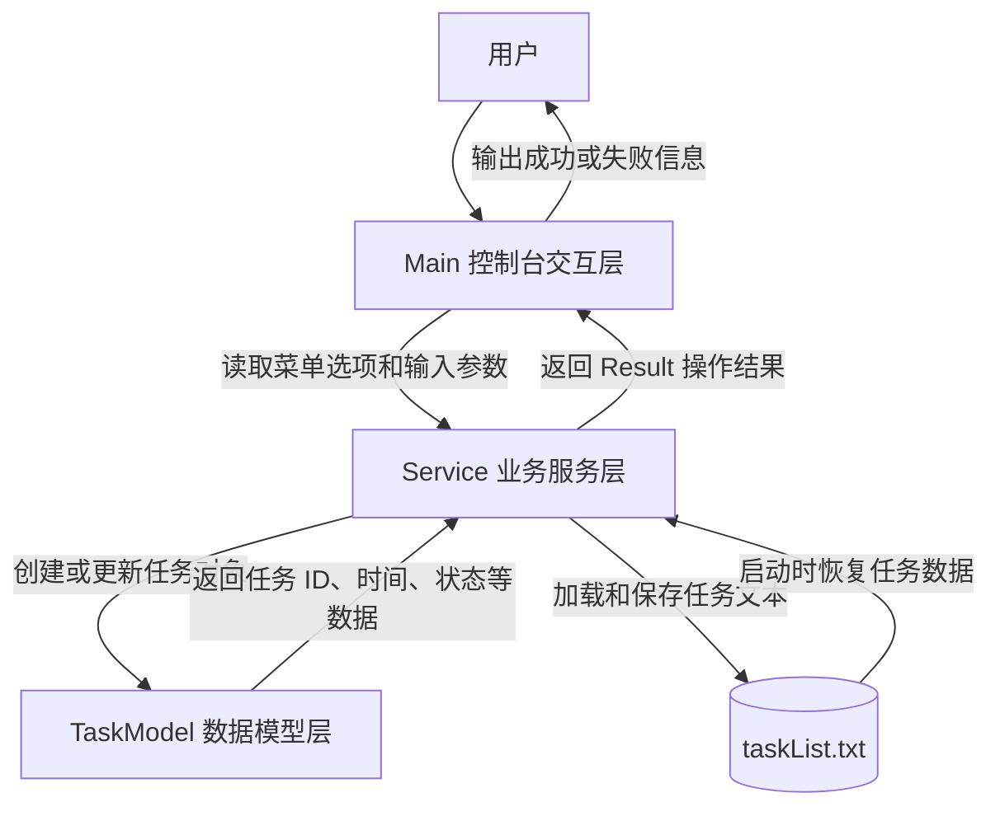

# TaskManagerSystem3.0

## 项目设计目的

TaskManagerSystem3.0 是一个基于 Java 控制台的任务管理系统。项目目标是用清晰的三层结构实现任务的创建、查询、完成、删除和本地持久化，帮助学习 Java 面向对象设计、文件读写、时间处理和基础测试方法。

系统以 `Main` 作为控制台入口，以 `Service` 作为业务处理中心，以 `TaskModel` 作为任务数据模型。任务数据保存在 `taskList.txt` 中，程序启动时加载文件，执行任务操作后写回文件。

## 应用场景

- 个人待办事项管理：记录任务名称、开始时间、结束时间和完成状态。
- Java 基础课程练习：演示控制台输入、集合存储、文件持久化、枚举状态和异常处理。
- 小型项目分层实践：通过 Main、Service、Model 三层拆分交互逻辑、业务逻辑和数据结构。
- 测试练习：使用纯 Java 测试文件验证任务创建、查询、完成、删除和持久化行为。

## 三层交互过程

## 核心功能

系统提供以下六大核心功能：

### 1. 创建任务
- **功能描述**：允许用户输入任务名称、开始时间和结束时间，创建新任务。
- **工作流程**：用户通过菜单选项 1 输入任务信息 → Main 验证并转发给 Service → Service 进行参数校验（任务名不为空、时间格式正确）→ 为任务分配唯一 ID 并初始化状态为 `TO_DO` → 加入内存任务集合。
- **关键验证**：任务名非空检查、时间格式 `yyyy-M-d H:m:s` 有效性检查、开始时间不晚于结束时间的检查。

### 2. 查询任务
- **功能描述**：分为两种查询模式，支持查看全部任务或查询特定任务。
- **查询全部任务**：通过菜单选项 2，输出当前系统中所有任务的详细信息（ID、名称、开始/结束时间、当前状态）。
- **查询单个任务**：通过菜单选项 3，输入任务 ID 精确查询该任务的完整信息。
- **数据隔离**：Service 返回任务的副本而非原引用，防止界面层直接修改内部集合。

### 3. 自动更改任务状态
- **功能描述**：根据用户预先设置的完成时间，每次查询，关闭系统，启动系统时，将超时的任务状态自动更改未`COMPLETED`
- **工作流程**：启动/关闭系统，查询任务状态->调用`GlobalScan`功能，扫描所有任务时间状态->超时自动更新任务状态
- **用途**：更改已超时的任务状态，确保每次用户提取信息时所有任务状态全部在正确状态中。

### 4. 完成任务
- **功能描述**：将指定任务的状态从 `TO_DO` 或 `IN_PROGRESS` 更新为 `COMPLETED`。
- **工作流程**：用户通过菜单选项 4 输入任务 ID → Service 查找该任务 → 更新任务状态为 `COMPLETED`。
- **用途**：标记已完成的工作，便于用户跟踪任务进度，已完成的任务在查询时可被区分。

### 5. 删除任务
- **功能描述**：从系统中彻底删除指定任务，释放内存空间。
- **工作流程**：用户通过菜单选项 5 输入任务 ID → Service 从任务集合中移除该任务 → 下次保存时删除信息从文件中去除。
- **使用场景**：清理过期任务、错误创建的任务，或完全不需要的任务。

### 6. 持久化存储
- **功能描述**：将内存中的任务数据保存到本地文件 `taskList.txt`，或从文件重新加载恢复任务数据。
- **保存机制**：菜单选项 6 或程序退出时自动触发，Service 将每个任务序列化为 `ID,名称,开始时间,结束时间,状态` 格式写入文件。
- **加载机制**：程序启动时自动从文件读取任务数据，恢复系统状态，并同步下一个可用任务 ID。
- **作用**：确保用户创建的任务在程序关闭后不会丢失，重启程序后能够继续管理已有任务。

## 核心模块说明

- `Main`：负责控制台菜单、用户输入和结果输出，不直接处理任务规则。
- `Service`：负责业务规则，包括参数校验、任务状态扫描、任务集合维护和文件读写。
- `TaskModel`：负责描述单个任务的数据结构，包括任务 ID、名称、开始时间、结束时间和状态。
- `Result` 包：负责封装不同操作的返回状态，使界面层可以根据状态输出对应提示。
- `test/com/zzm/ServiceTest.java`：纯 Java 测试入口，用自定义断言验证核心业务行为。

# github个人仓库网址
> https://github.com/Z-ZM-creator
