# 大学生学习任务管理系统

## 中文版

## 一、项目背景与应用场景

大学生在日常学习中经常需要同时处理很多任务，例如课程作业、实验报告、复习计划、小组任务和课程项目等。如果任务只靠记忆或零散记录，很容易出现忘记任务、错过时间、安排混乱等问题。

本项目选择“大学生学习任务管理”作为应用场景，目的是提供一个简单清晰的任务管理工具。用户可以用它记录任务、查看任务、完成任务和删除任务，让学习安排更加清楚。

本系统适合以下场景：

- 记录课程作业、实验任务和复习计划。
- 查看当前有哪些学习任务。
- 标记已经完成的任务。
- 删除不需要继续保留的任务。
- 关闭系统后继续保留已经记录的任务。

## 二、功能需求描述

本系统主要实现以下功能：

### 1. 添加任务

用户可以录入新的学习任务，包括任务名称、开始时间和结束时间。该功能可以用来记录课程作业、实验任务、复习计划等事项。

### 2. 查询任务

用户可以查看所有任务，也可以根据任务编号查看某一个具体任务，方便快速了解自己的学习安排。

### 3. 完成任务

当某项任务已经完成后，用户可以将该任务标记为已完成，方便区分已完成任务和未完成任务。

### 4. 删除任务

对于已经不需要继续保留的任务，用户可以将其删除，使任务列表保持简洁。

### 5. 自动检查任务状态

系统可以根据任务时间检查任务状态，帮助用户发现已经到期的任务，减少任务遗漏。

### 6. 保留历史任务数据

用户关闭系统后，已经记录的任务不会丢失。下次打开系统时，用户仍然可以继续查看和管理任务。

## 三、系统使用流程

用户打开系统后，会看到功能菜单，并根据菜单提示选择操作。

1. 选择添加任务，输入任务名称、开始时间和结束时间。
2. 选择查询所有任务，查看当前任务列表。
3. 选择查询单个任务，输入任务编号并查看任务详情。
4. 选择完成任务，输入任务编号并标记任务完成。
5. 选择删除任务，输入任务编号并删除任务。
6. 选择保存任务，保存当前任务数据。
7. 选择退出系统，系统自动保存任务数据。

## 四、系统设计与实现思路

系统按照用户操作过程进行设计，主要分为交互层、功能处理层、任务数据层、结果反馈层和数据保存部分。每一部分负责不同工作，使系统结构更加清晰。

系统层级交互关系如下：

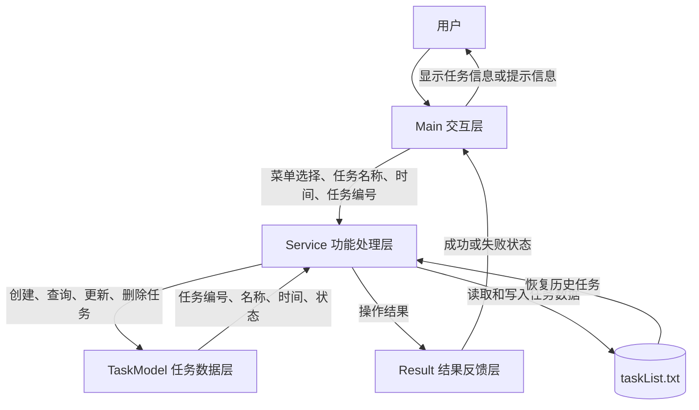

### 1. 交互层

`Main` 类负责显示菜单、读取用户输入和输出结果。用户输入任务名称、时间或任务编号后，`Main` 会把这些信息传给 `Service` 处理。

### 2. 功能处理层

`Service` 类负责系统的主要功能，包括添加任务、查询任务、完成任务、删除任务、检查任务状态和保存任务数据。

### 3. 任务数据层

`TaskModel` 类用于表示一条任务。每条任务包含任务编号、任务名称、开始时间、结束时间和任务状态。

任务状态包括：

- `TO_DO`：任务尚未开始。
- `IN_PROGRESS`：任务正在进行。
- `COMPLETED`：任务已经完成。

### 4. 结果反馈层

`Result` 包中的类用于保存操作结果。系统可以根据结果判断操作是否成功，并向用户输出对应提示。

### 5. 数据保存

系统使用 `taskList.txt` 保存任务数据。程序启动时读取该文件，任务发生变化后再写回该文件。

## 五、核心功能实现说明

### 1. 添加任务

交互与数据流图：

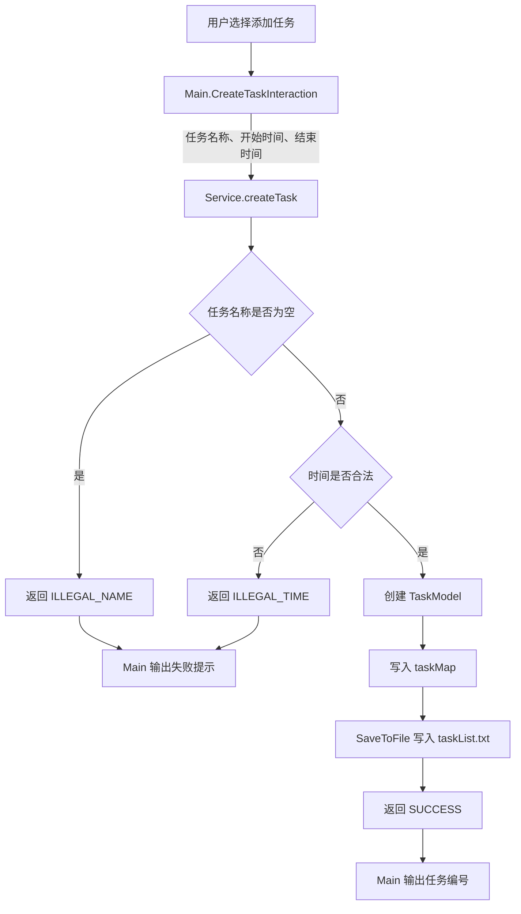

用户选择添加任务后，`Main.CreateTaskInteraction()` 读取任务名称、开始时间和结束时间，并调用 `Service.createTask()`。

`Service.createTask()` 会判断任务名称是否为空，判断时间格式和时间顺序是否合理。如果输入合法，系统创建 `TaskModel` 对象，并自动生成任务编号。

如果任务名称为空，系统返回 `ILLEGAL_NAME`。如果时间格式错误或时间不合理，系统返回 `ILLEGAL_TIME`。

添加成功后，任务会进入 `taskMap`，并通过 `SaveToFile()` 写入 `taskList.txt`。保存格式如下：

```text
任务编号,任务名称,开始时间,结束时间,任务状态
```

---

### 2. 查询任务

交互与数据流图：

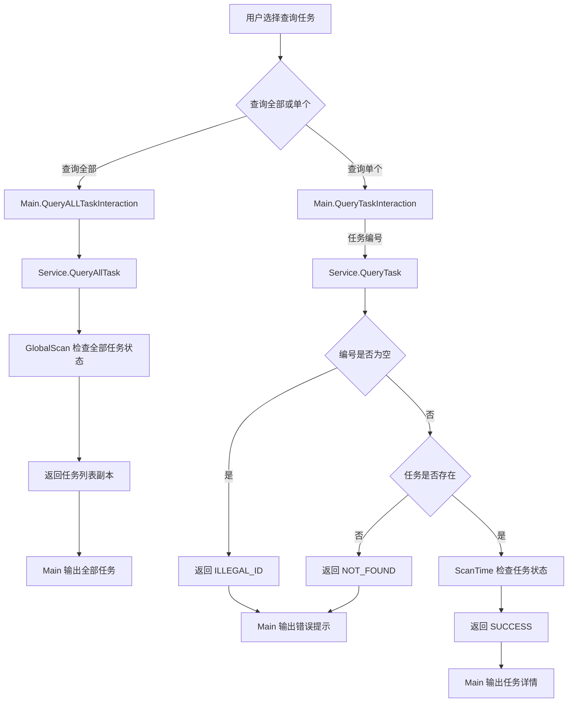

查询全部任务时，`Main.QueryALLTaskInteraction()` 调用 `Service.QueryAllTask()`。系统先检查全部任务状态，再返回任务列表。

查询单个任务时，`Main.QueryTaskInteraction()` 读取任务编号，并调用 `Service.QueryTask()`。系统会判断任务编号是否为空，以及任务是否存在。

如果任务编号为空，系统返回 `ILLEGAL_ID`。如果任务不存在，系统返回 `NOT_FOUND`。

查询操作不会新增或删除任务，但可能会触发状态更新。例如任务可能从 `TO_DO` 变为 `IN_PROGRESS`，也可能变为 `COMPLETED`。

---

### 3. 完成任务

交互与数据流图：

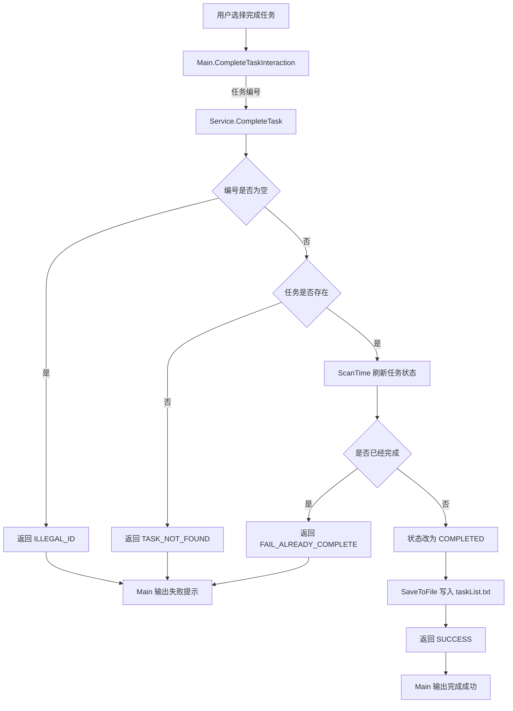

用户选择完成任务后，`Main.CompleteTaskInteraction()` 读取任务编号，并调用 `Service.CompleteTask()`。

系统先判断任务编号是否为空，再判断任务是否存在。任务存在时，系统会调用 `ScanTime()` 刷新任务状态。

如果任务不存在，系统返回 `TASK_NOT_FOUND`。如果任务已经完成，系统返回 `FAIL_ALREADY_COMPLETE`。

完成成功后，任务状态会被改为 `COMPLETED`，并写回 `taskList.txt`。

---

### 4. 删除任务

交互与数据流图：

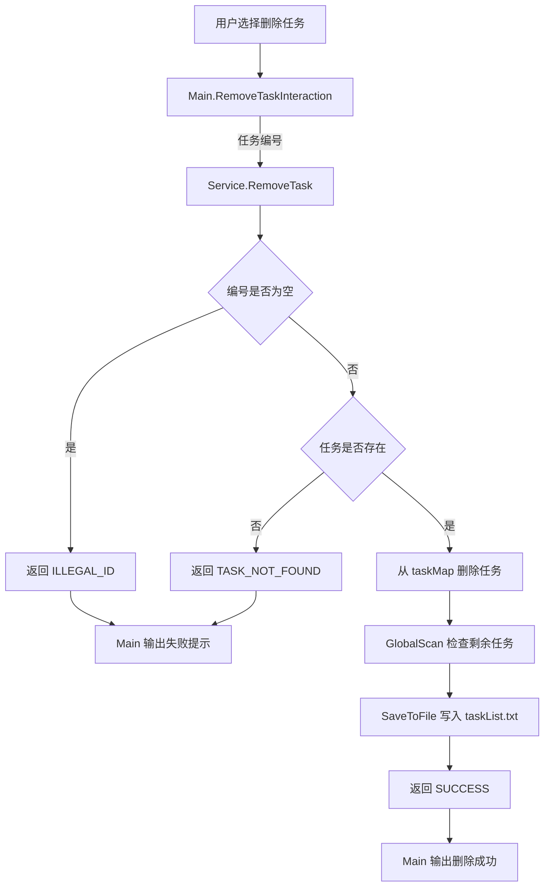

用户选择删除任务后，`Main.RemoveTaskInteraction()` 读取任务编号，并调用 `Service.RemoveTask()`。

系统先判断任务编号是否为空，再判断任务是否存在。只有任务存在时，系统才会删除任务。

如果任务编号为空，系统返回 `ILLEGAL_ID`。如果任务不存在，系统返回 `TASK_NOT_FOUND`。

删除成功后，任务会从 `taskMap` 中移除。系统随后重新保存任务列表到 `taskList.txt`。

---

### 5. 自动检查任务状态

交互与数据流图：

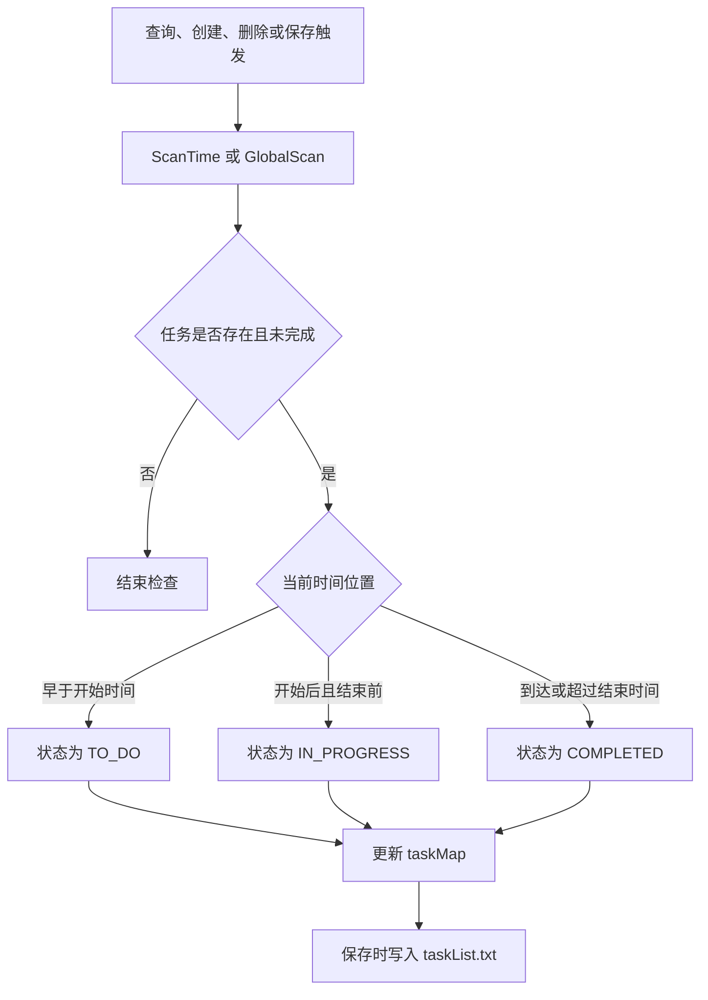

自动检查不需要用户单独操作。系统会在查询、创建、删除或保存任务时检查任务状态。

`Service.ScanTime()` 用于检查单个任务。`Service.GlobalScan()` 用于检查全部任务。

系统会根据当前时间、任务开始时间和任务结束时间判断任务状态。如果任务已经是 `COMPLETED`，系统不会重复更新。

状态变化会先更新到 `taskMap` 中。后续保存时，新的状态会写入 `taskList.txt`。

---

### 6. 保留历史任务数据

交互与数据流图：

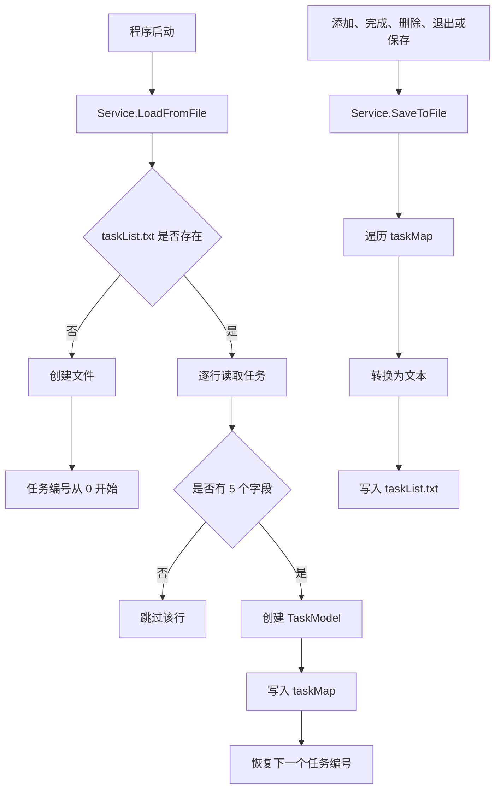

程序启动时，`Service.LoadFromFile()` 从 `taskList.txt` 读取历史任务。

如果文件不存在，系统会创建文件。如果文件存在，系统会逐行读取任务数据，并恢复任务对象。

保存任务时，`Service.SaveToFile()` 会遍历 `taskMap`，把任务转换为文本并写入 `taskList.txt`。

如果文件读取或写入出错，系统会捕获异常并输出错误信息，方便检查问题。

## 六、项目个性化设计

本项目选择大学生学习任务管理作为应用场景，来源于本人在日常学习中经常需要同时处理课程作业、实验报告、复习计划和项目任务的实际情况。相比普通的待办事项记录，本系统加入了任务开始时间、结束时间和状态变化，使任务不仅能被记录，还能体现其执行过程。

同时，系统保留了任务编号查询、任务状态自动变化和历史任务保存等设计，使用户能够更方便地管理学习任务。

## 七、项目总结

本项目围绕大学生学习任务管理这一场景，完成了任务添加、查询、完成、删除、状态检查和历史数据保存等功能。系统可以帮助用户集中记录学习任务，并通过任务状态变化提醒用户关注任务进度。

通过本项目，可以理解一个任务管理工具从用户需求到系统实现的基本过程。项目功能贴近学习生活，结构清晰，适合作为个人学习任务管理的基础工具。

## 八、仓库地址

> https://github.com/Z-ZM-creator

---

# Student Study Task Management System

## English Version

## 1. Project Background and Use Case

Students have many study tasks.

They may have homework, lab reports, review plans, group work, and course projects.

If students only use memory, they may forget tasks.

They may miss time.

They may feel study plans are not clear.

This project is a simple study task tool.

Users can add tasks, view tasks, finish tasks, and delete tasks.

The system helps users make study plans clear.

## 2. Function Description

This system has these main functions.

### 1. Add Task

The user can add a new study task.

The task has a name, a start time, and an end time.

### 2. Query Task

The user can view all tasks.

The user can also view one task by task id.

### 3. Complete Task

The user can mark a task as completed.

This helps users know which tasks are done.

### 4. Delete Task

The user can delete a task.

This keeps the task list simple.

### 5. Check Task Status

The system can check task status by time.

It can find tasks that are already due.

### 6. Keep Task Data

The task data is not lost after the system is closed.

The user can open the system again and see old tasks.

## 3. System Use Flow

The user opens the system.

The system shows a menu.

1. Choose add task. Enter task name, start time, and end time.
2. Choose query all tasks. View the task list.
3. Choose query one task. Enter task id and view task detail.
4. Choose complete task. Enter task id and mark it done.
5. Choose delete task. Enter task id and delete it.
6. Choose save task. Save current task data.
7. Choose exit. The system saves data and exits.

## 4. System Design

The system has five parts.

- `Main`: reads user input and shows output.
- `Service`: handles task rules.
- `TaskModel`: stores one task.
- `Result`: stores operation result.
- `taskList.txt`: stores task data.

System relation:

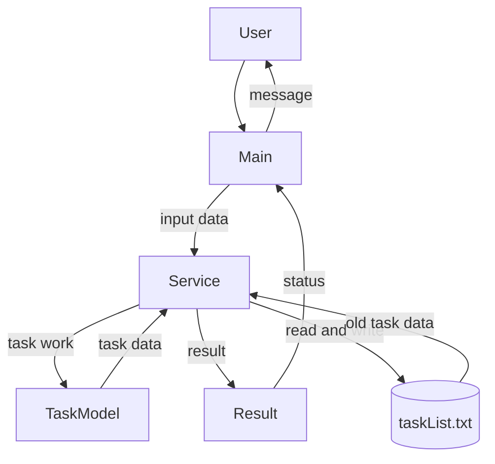

Task status has three values.

- `TO_DO`: the task has not started.
- `IN_PROGRESS`: the task is in progress.
- `COMPLETED`: the task is done.

## 5. Core Function Implementation

### 1. Add Task

Flow:

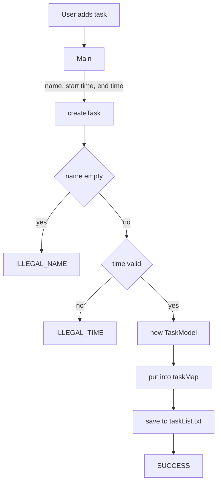

`Main` reads task data.

`Service.createTask()` checks the name and time.

If the data is valid, the system creates a `TaskModel`.

The task is put into `taskMap`.

The task is saved to `taskList.txt`.

---

### 2. Query Task

Flow:

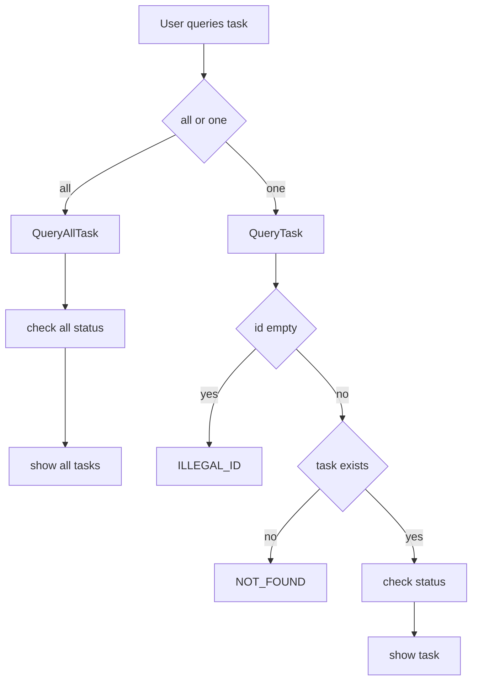

The user can query all tasks.

The user can query one task by id.

The system checks task status before showing data.

If the id is wrong, the system shows an error.

---

### 3. Complete Task

Flow:

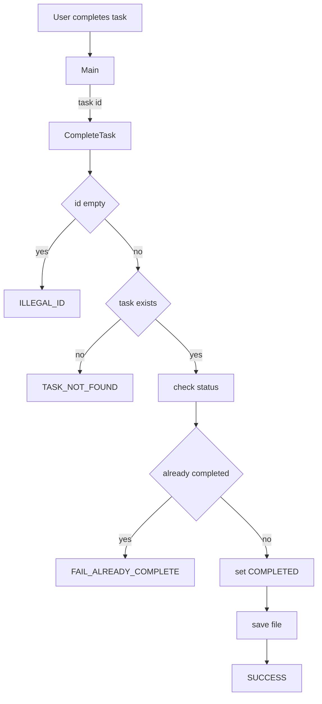

The user enters a task id.

The system finds the task.

If the task is not completed, the system sets it to `COMPLETED`.

Then the system saves the new data.

---

### 4. Delete Task

Flow:

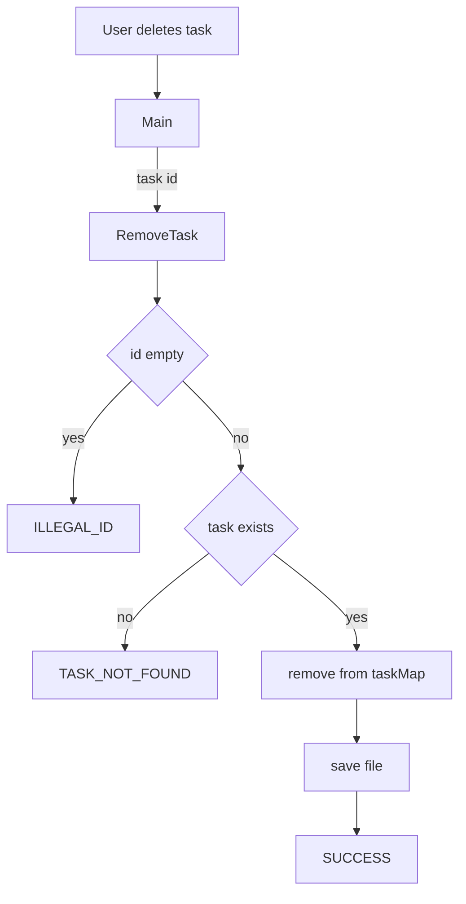

The user enters a task id.

The system checks if the task exists.

If it exists, the system removes it from `taskMap`.

Then the system saves the file again.

---

### 5. Check Task Status

Flow:

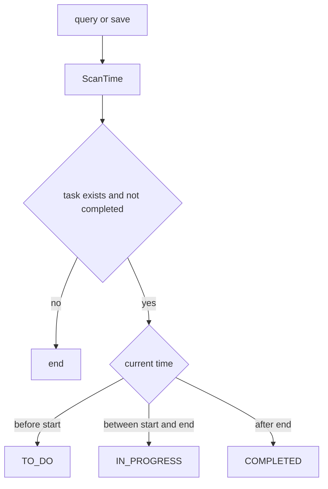

The system compares current time with task time.

If current time is before start time, the task is `TO_DO`.

If current time is between start time and end time, the task is `IN_PROGRESS`.

If current time is after end time, the task is `COMPLETED`.

---

### 6. Keep Task Data

Flow:

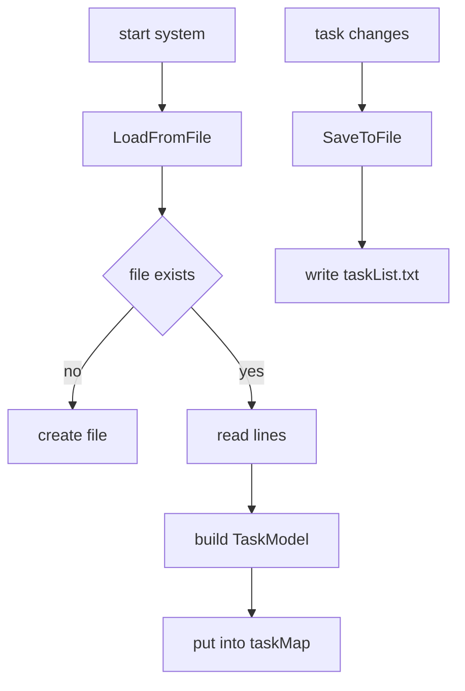

When the system starts, it reads `taskList.txt`.

Old tasks are loaded into `taskMap`.

When tasks change, the system writes data back to `taskList.txt`.

One line has this format:

```text
task id,task name,start time,end time,task status
```

## 6. Personal Design

This project uses the student study task scene.

This comes from daily study.

Students often have many tasks at the same time.

This system uses start time, end time, and status.

So a task is not only saved.

It also shows its process.

## 7. Project Summary

This project is a study task management system.

It can add, query, complete, delete, check, and save tasks.

It helps students manage study tasks.

It makes study plans clearer.

## 8. Repository

> https://github.com/Z-ZM-creator
