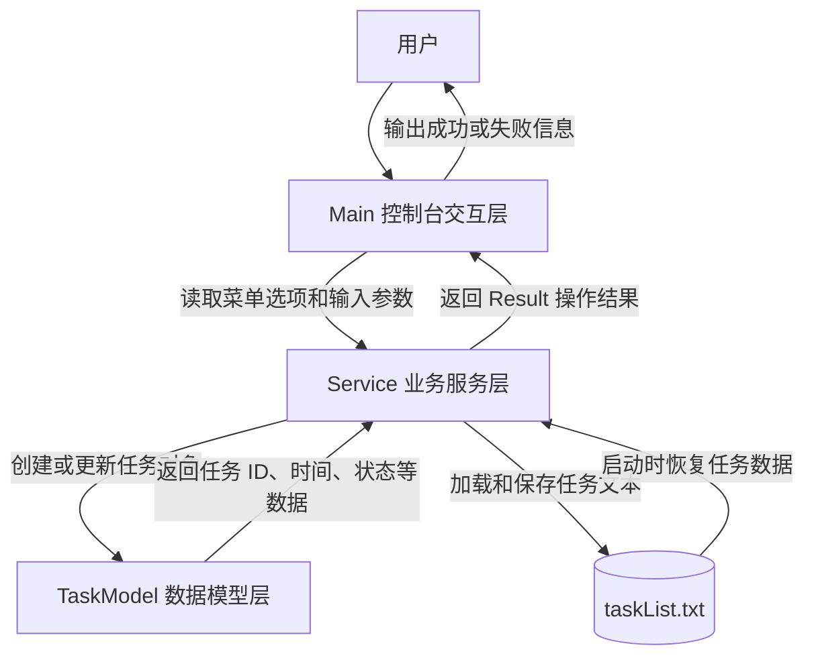

# TaskManagerSystem3.0

## 项目设计目的

TaskManagerSystem3.0 是一个基于 Java 控制台的任务管理系统。项目目标是用清晰的三层结构实现任务的创建、查询、完成、删除和本地持久化，帮助学习 Java 面向对象设计、文件读写、时间处理和基础测试方法。

系统以 `Main` 作为控制台入口，以 `Service` 作为业务处理中心，以 `TaskModel` 作为任务数据模型。任务数据保存在 `taskList.txt` 中，程序启动时加载文件，执行任务操作后写回文件。

## 应用场景

- 个人待办事项管理：记录任务名称、开始时间、结束时间和完成状态。
- Java 基础课程练习：演示控制台输入、集合存储、文件持久化、枚举状态和异常处理。
- 小型项目分层实践：通过 Main、Service、Model 三层拆分交互逻辑、业务逻辑和数据结构。
- 测试练习：使用纯 Java 测试文件验证任务创建、查询、完成、删除和持久化行为。

## 三层交互过程

## 核心模块说明

- `Main`：负责控制台菜单、用户输入和结果输出，不直接处理任务规则。
- `Service`：负责业务规则，包括参数校验、任务状态扫描、任务集合维护和文件读写。
- `TaskModel`：负责描述单个任务的数据结构，包括任务 ID、名称、开始时间、结束时间和状态。
- `Result` 包：负责封装不同操作的返回状态，使界面层可以根据状态输出对应提示。
- `test/com/zzm/ServiceTest.java`：纯 Java 测试入口，用自定义断言验证核心业务行为。

# github个人仓库网址
> https://github.com/Z-ZM-creator
